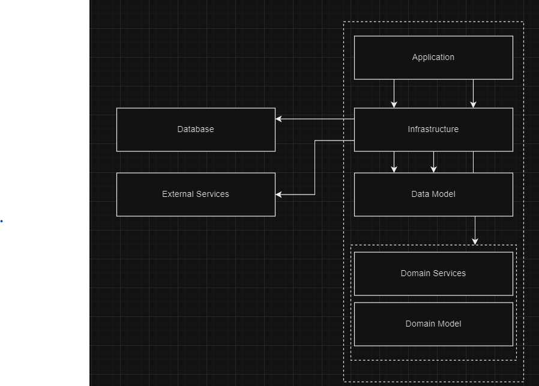

# DDD Implementation
This document serves as a guide on how Domain Driven Design was implemented in this application's architecture

## Overview
Below is a diagram that show the DDD Implementation. Please note dependency flow down to up.  
The lower layer (Domain Model) has no dependency on any other layer and Domain service only depends on domain model etc.
